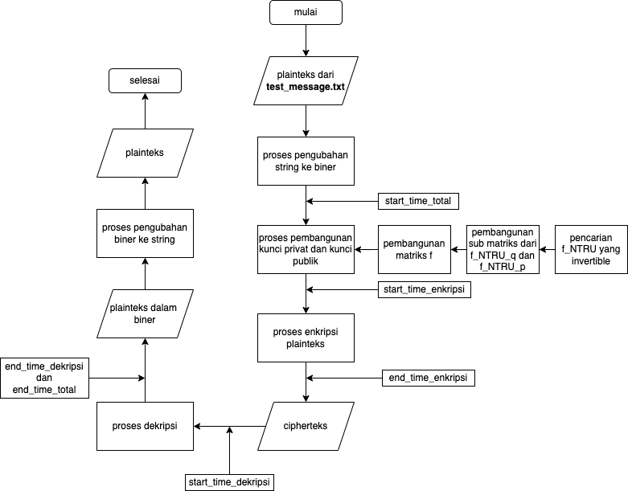

# GTRU-Gn
The file ***GTRUGnMain.py*** is a program written in Python that simulates the key generation, encryption and decryption of GTRU using the group $\mathbb{Z}^n$. Now, finding an inverse modulo matrix could be costly and time consuming. Thus, I have modified the key space in GTRU-G such that matrix inversion can be done so much faster. Recall that NTRU is a public-key cryptosystem that works on the ring polynomial $\mathcal{R} = \mathbb{Z}[x]/\langle x^N -1 \rangle$ and every key $f(x) \in \mathcal{R}$ is a unit. Hence, we can apply the same logic in GTRU. Choose a unit element in $\mathcal{R}$ and place the polynomial as the first row of our matrix. Next, we build a circulant matrix based on the first row. With that, the inverse matrix would be the circulant matrix of the inverse polynomial that we just picked. That is how easy it is to calculate the inverse of our matrix. The image below shows the flowchart of the code. 

<br/>
An example output of the program is as follow,
```python
The public parameters are: n=251, p=3, q=2521
encryption result: 
 [-483 1210 1230 ... 1206    0   -3]
--- encryption time : 12.073993682861328 miliseconds ---

decryption result:
Lorem ipsum dolor sit amet, consectetur efficitur.
--- decryption time : 10.025978088378906 milidetik ---

--- performance time (key generation + encryption + decryption time) : 1.7997219562530518 seconds ---
```
The file ***GTRUGMainAverage.py*** is a program written in Python that calculates the average time for GTRU to do its encryption and decryption as well as the overall performance time GTRU has. Furthermore, this file also calculate the efficieny of GTRU in regards of CPU usage.